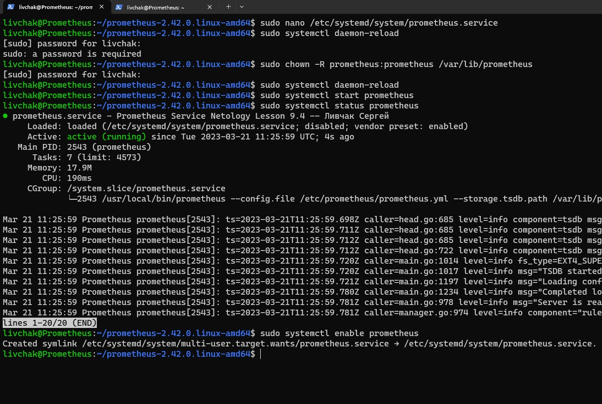
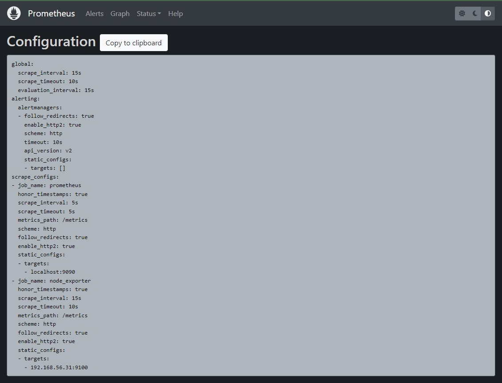
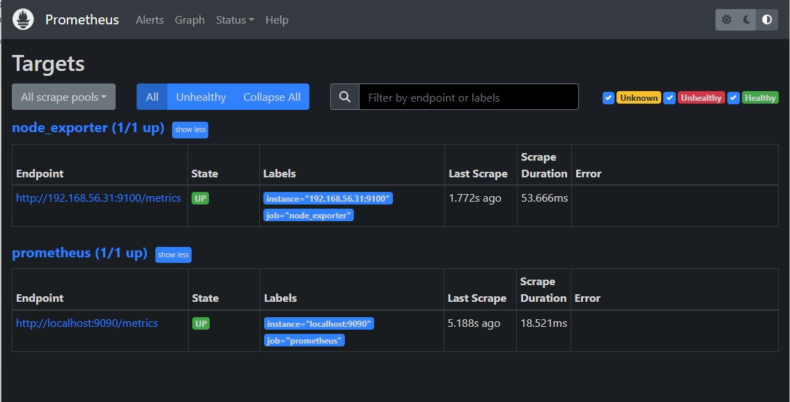
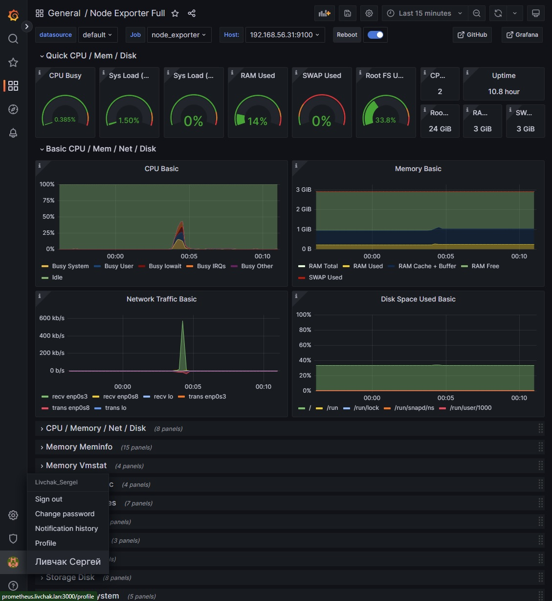
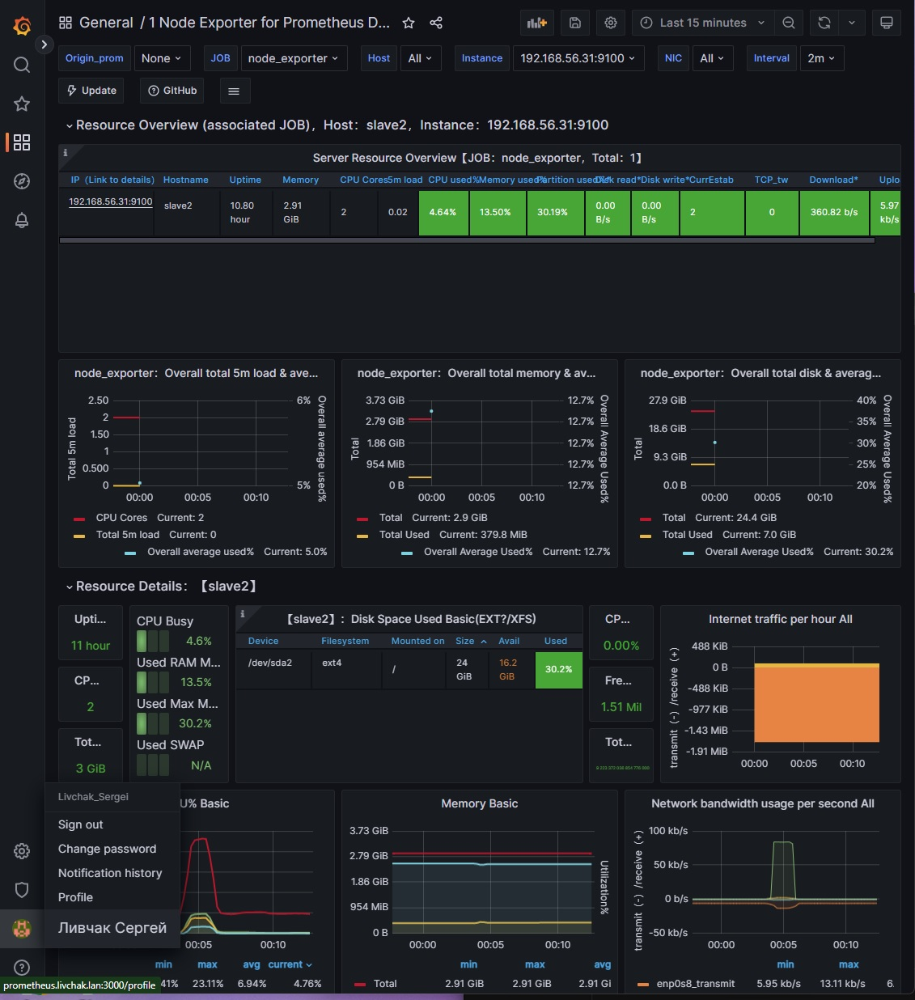

# Домашнее задание к занятию "`9-04hw`" - `Ливчак Сергей`

---

### Задание 1

`Установите Prometheus.`

**Скриншот 1-1_1** 

---

### Задание 2

`Установите Node Exporter.`

**Скриншот 2-1_1** 

---

### Задание 3

`Подключите Node Exporter к серверу Prometheus.`

**Скриншот 3-1_1** 

**Скриншот 3-2_1** 

---
## Дополнительные задания (со звездочкой*)
---

### Задание 4*

`Установите Grafana.`

**Скриншот 4-1_1** 

---

### Задание 5*

`Интегрируйте Grafana и Prometheus.`

**Скриншот 5-1_1** 
